# 🏦 Belimbing Bank Saving System
> **Belimbing.ai Full Stack Engineer Intern Test** — Muhammad Afif Naufal

---

## 🌐 Live Demo

| Service | URL |
|---------|-----|
| Frontend | `https://belimbing-bank-saving-system-test.vercel.app` |
| Backend API | `https://belimbing-bank-saving-system-test.up.railway.app` |
| **API Docs (Swagger)** | `https://belimbing-bank-saving-system-test.up.railway.app/api/docs` |

---

## 📋 Table of Contents

1. [Overview](#overview)
2. [Tech Stack](#tech-stack)
3. [Architecture](#architecture)
4. [Wireframe / UI Mockup](#wireframe--ui-mockup)
5. [Database Design](#database-design)
6. [UML Sequence Diagram](#uml-sequence-diagram)
7. [Class Diagram](#class-diagram)
8. [Use Case Diagram](#use-case-diagram)
9. [Project Structure](#project-structure)
10. [Business Logic](#business-logic)
11. [API Endpoints](#api-endpoints)
12. [Local Setup](#local-setup)
13. [Deploy](#deploy)
14. [Error Handling](#error-handling)

---

## Overview

A web-based Bank Saving System that allows bank staff to manage customers, accounts, deposito (savings) products, and financial transactions with **automatic interest calculation on withdrawal**.

**Key Features:**
- ✅ CRUD Customers, Deposito Types, Accounts
- ✅ Deposit — add balance to an account, record transaction date
- ✅ Withdraw — deduct balance with auto interest calculation
- ✅ Full transaction history per account
- ✅ Dashboard with AUM stats, deposito distribution, top accounts
- ✅ Interactive API documentation (Swagger UI)

---

## Tech Stack

| Layer    | Technology                      | Reason |
|----------|---------------------------------|--------|
| Backend  | Node.js + Express.js            | Lightweight, fast REST API |
| ORM      | Sequelize v6                    | SQL abstraction, associations, transactions |
| Database | MySQL 8                         | Relational integrity for financial data |
| Frontend | React.js 18 + React Router v6   | Component-based SPA, industry standard |
| HTTP     | Axios                           | Promise-based HTTP with interceptors |
| UI       | Custom CSS (DM Sans + DM Serif) | No heavy UI lib dependency |
| Toast    | react-hot-toast                 | Non-blocking user feedback |
| API Docs | Swagger UI (swagger-ui-express) | Interactive, self-hosted documentation |
| Deploy   | Railway (BE) + Vercel (FE)      | Free tier, auto-deploy from GitHub |

---

## Architecture

This project follows the **MVC (Model-View-Controller)** pattern on both backend and frontend.

### Backend MVC

```
Request → Route → Middleware (validate) → Controller → Model (Sequelize) → DB
                                              ↓
                                       Response Helper
                                              ↓
                                          Response
```

| Layer | Role | Files |
|-------|------|-------|
| **Model** | Data schema, associations, instance methods | `src/models/*.js` |
| **Controller** | Business logic, calls Model, returns response | `src/controllers/*.js` |
| **View (Route)** | Maps HTTP verbs + paths to controllers | `src/routes/index.js` |
| **Middleware** | Input validation, response formatting | `src/middleware/` |

### Frontend MVC

```
User Action → Page Component (View) → api/index.js (Axios) → Backend API
                    ↓                        ↑
              useApi hook (Controller)   HTTP Response
                    ↓
               useState (Model/State)
```

| Layer | Role | Files |
|-------|------|-------|
| **Model** | App state (useState/useCallback), API response shape | `src/hooks/useApi.js` |
| **View** | JSX pages and reusable components | `src/pages/*.jsx`, `src/components/` |
| **Controller** | Logic between View and API calls | `src/api/index.js`, event handlers in pages |

---

## Wireframe / UI Mockup

🔗 **Figma (Interactive):** [View Full Mockup →](<https://www.figma.com/design/9QFhDLSMHWChafHyG7HSgG/belimbing-test?node-id=0-1&t=gA9X8tOlRZFSLTSP-1>)

> Click the Figma link above to explore the interactive mockup. Static previews per screen below.

### Screen 1 — Dashboard
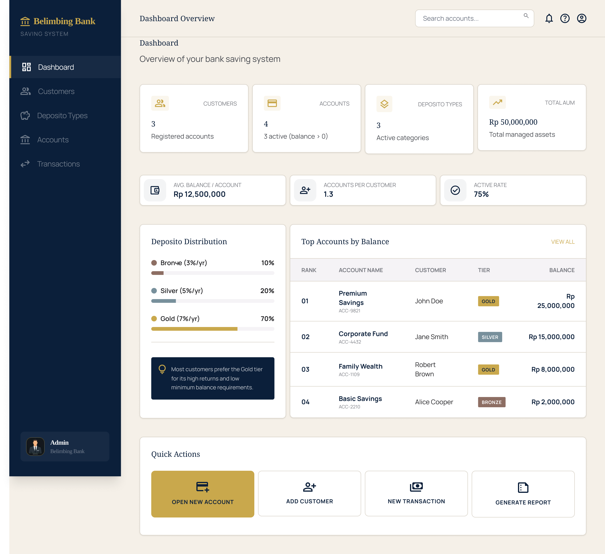

### Screen 2 — Customers
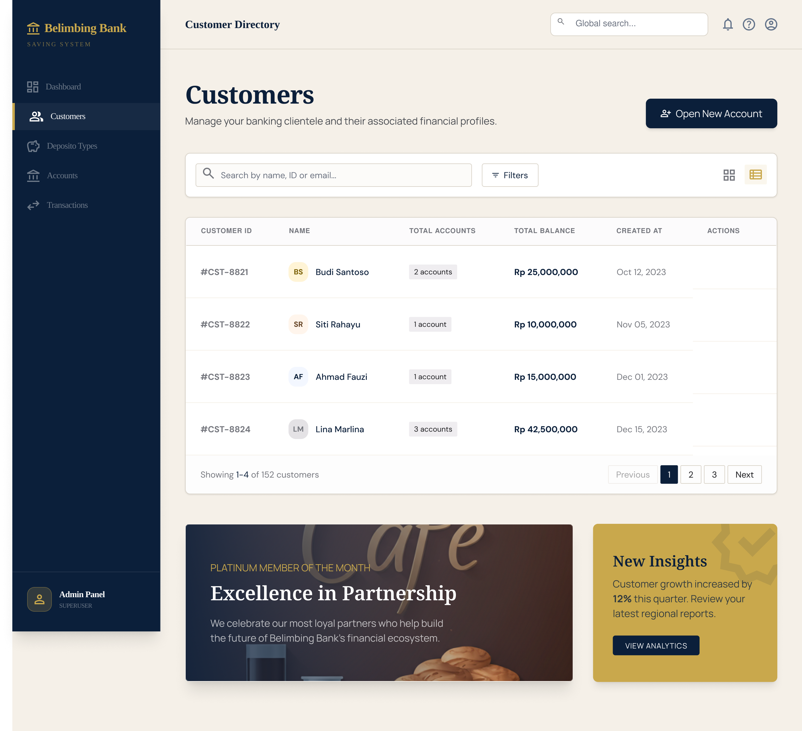

### Screen 3 — Deposito Types
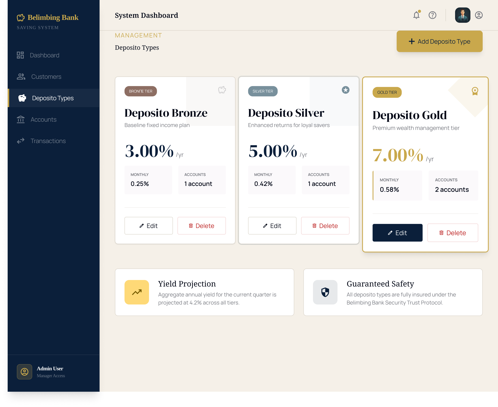

### Screen 4 — Accounts
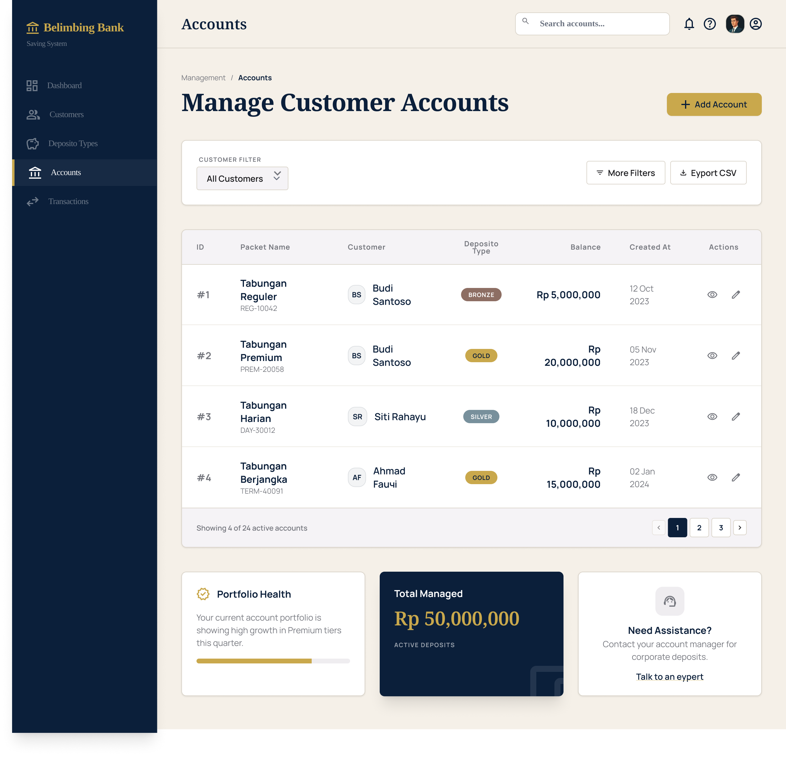

### Screen 5 — Transactions
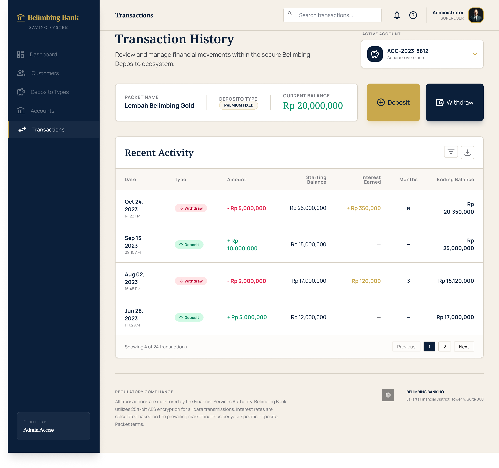

### Screen 6 — Withdraw Modal
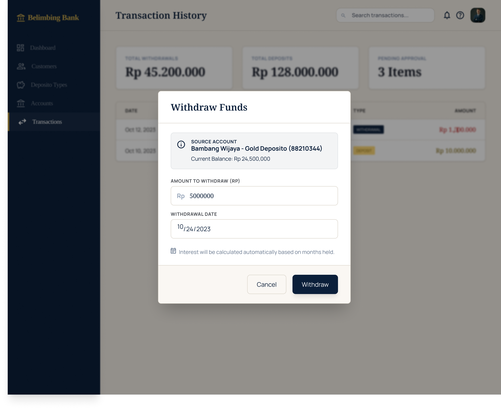

### Screen 7 — Add Customer Modal
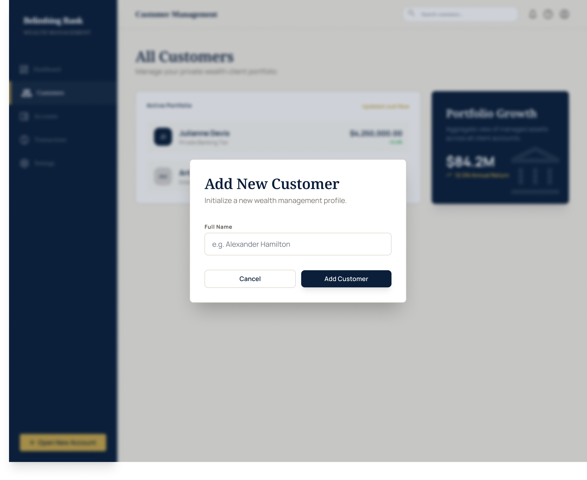

---

## Database Design

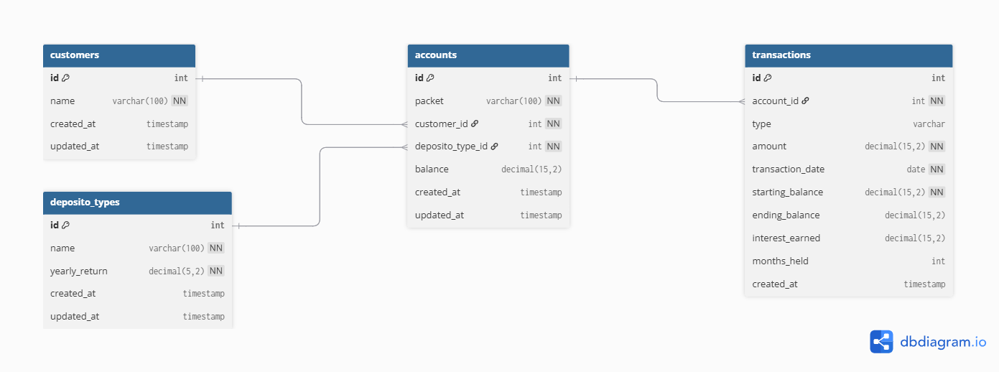

### ERD Summary

```
CUSTOMERS ──< ACCOUNTS >── DEPOSITO_TYPES
                │
            TRANSACTIONS
```

| Table | Key Columns | Constraint |
|-------|------------|-----------|
| `customers` | id, name | — |
| `deposito_types` | id, name, yearly_return | name UNIQUE |
| `accounts` | id, packet, customer_id, deposito_type_id, balance | FK RESTRICT |
| `transactions` | id, account_id, type, amount, transaction_date, starting_balance, ending_balance, interest_earned, months_held | FK CASCADE |

### Design Decisions

**Why store `starting_balance` and `ending_balance` on every transaction?**
Financial systems require an immutable audit trail. Even if an account balance changes, historical records must remain accurate independently.

**Why `ON DELETE RESTRICT` for customer → accounts and deposito_type → accounts?**
Prevents accidental data loss. A customer with active savings should never be silently deleted.

**Why `ON DELETE CASCADE` for account → transactions?**
When an account is explicitly deleted, its transaction history has no standalone meaning and should be cleaned up automatically.

---

## UML Sequence Diagram

> Full flow of the most complex operation: **Withdraw with interest calculation**

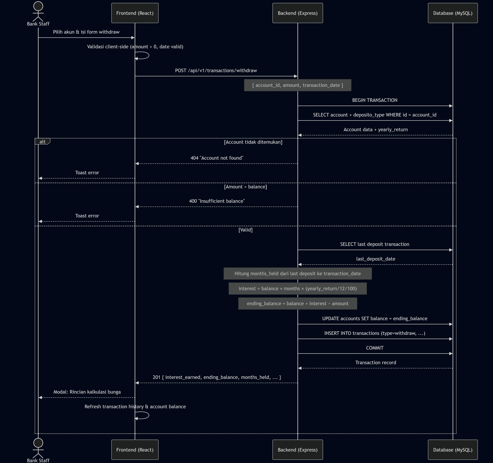

---

## Class Diagram

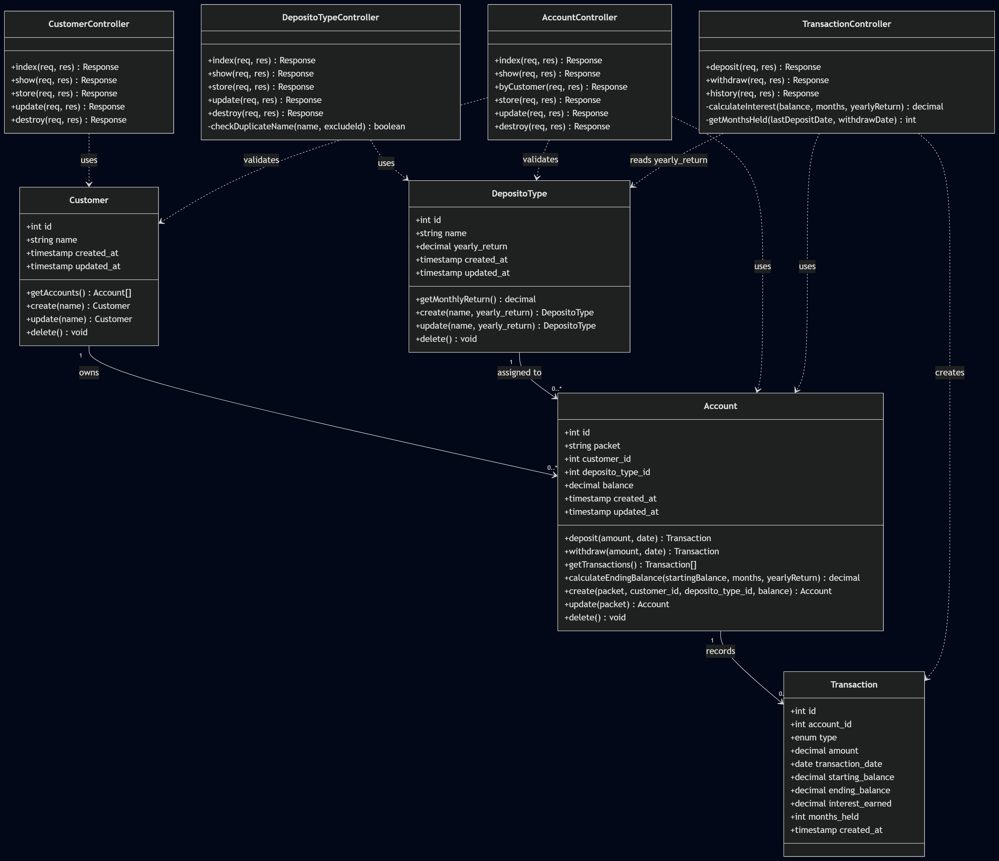

---

## Use Case Diagram

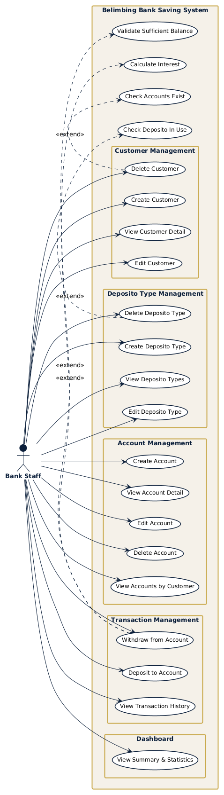

---

## Project Structure

```
belimbing-bank-saving-system/
├── backend/
│   ├── src/
│   │   ├── app.js                         ← Entry point, Express setup, Swagger mount
│   │   ├── swagger.yaml                   ← OpenAPI 3.0 spec (all 10 endpoints)
│   │   ├── config/
│   │   │   ├── database.js                ← Sequelize config (reads .env)
│   │   │   └── sequelize.js               ← Sequelize instance
│   │   ├── models/
│   │   │   ├── Customer.js
│   │   │   ├── DepositoType.js            ← getMonthlyReturn() instance method
│   │   │   ├── Account.js                 ← calculateEndingBalance() instance method
│   │   │   ├── Transaction.js
│   │   │   └── index.js                   ← Association definitions
│   │   ├── controllers/
│   │   │   ├── CustomerController.js
│   │   │   ├── DepositoTypeController.js  ← Duplicate name check on create & update
│   │   │   ├── AccountController.js
│   │   │   └── TransactionController.js  ← Deposit + Withdraw + interest calc (DB transaction)
│   │   ├── routes/
│   │   │   └── index.js                   ← All route definitions with validators
│   │   └── middleware/
│   │       ├── response.js                ← Unified response helper
│   │       └── validate.js                ← express-validator error handler
│   ├── .env.example
│   ├── package.json
│   └── railway.json
│
├── frontend/
│   ├── src/
│   │   ├── api/index.js                   ← All Axios calls, error interceptor
│   │   ├── components/common/
│   │   │   ├── Sidebar.jsx
│   │   │   ├── Modal.jsx
│   │   │   └── ConfirmDelete.jsx
│   │   ├── hooks/useApi.js                ← Custom hook: loading/error state wrapper
│   │   ├── pages/
│   │   │   ├── Dashboard.jsx              ← Stats, deposito distribution, top accounts
│   │   │   ├── Customers.jsx
│   │   │   ├── DepositoTypes.jsx
│   │   │   ├── Accounts.jsx
│   │   │   └── Transactions.jsx           ← Deposit/Withdraw + interest breakdown modal
│   │   ├── utils/format.js                ← formatRupiah, formatDate, todayISO
│   │   ├── index.css
│   │   └── App.jsx
│   ├── package.json
│   └── vercel.json
│
└── docs/
    ├── SYSTEM_SPEC.md                     ← Full system specification
    ├── API_CALLS_PER_SCREEN.md            ← API mapping per frontend screen
    ├── database.sql                       ← Schema + seed data
    ├── diagrams/
    │   ├── wireframe_01_dashboard.png     ← UI Mockup — Dashboard
    │   ├── wireframe_02_customers.png     ← UI Mockup — Customers
    │   ├── wireframe_03_deposito_types.png← UI Mockup — Deposito Types
    │   ├── wireframe_04_accounts.png      ← UI Mockup — Accounts
    │   ├── wireframe_05_transactions.png  ← UI Mockup — Transactions
    │   ├── wireframe_06_withdraw_modal.png← UI Mockup — Withdraw Modal
    │   ├── erd.png                        ← Entity Relationship Diagram
    │   ├── uml_sequence.png               ← UML Sequence Diagram
    │   ├── class_diagram.png              ← Class Diagram
    │   └── use_case.png                   ← Use Case Diagram
    ├── Belimbing_Bank_API.postman_collection.json
    └── Belimbing_Bank.postman_environment.json
```

---

## Business Logic

### Deposit
1. Validate: amount > 0, account exists, date valid
2. `new_balance = current_balance + amount`
3. Update account balance
4. Record transaction
5. All steps wrapped in a **database transaction** — rolled back on any failure

### Withdraw + Interest Calculation
1. Validate: amount > 0, amount ≤ current_balance
2. Find last deposit date (fallback: account creation date)
3. Calculate months held between last deposit and withdrawal date
4. Apply formula:

```
monthly_return_rate   = yearly_return / 12 / 100
interest_earned       = starting_balance × months_held × monthly_return_rate
balance_with_interest = starting_balance + interest_earned
ending_balance        = balance_with_interest − amount_withdrawn
```

**Example:** Rp 5,000,000 held 3 months at Gold (7%/yr)
```
monthly_rate  = 7 / 12 / 100  = 0.005833
interest      = 5,000,000 × 3 × 0.005833 = Rp 87,500
balance+int   = Rp 5,087,500
ending (−500k)= Rp 4,587,500
```

---

## API Endpoints

Base URL: `http://localhost:5000/api/v1` · Full docs: `/api/docs`

| Resource | Method | Endpoint | Description |
|----------|--------|----------|-------------|
| Customers | GET | `/customers` | List all |
| | GET | `/customers/:id` | Detail + accounts |
| | POST | `/customers` | Create |
| | PUT | `/customers/:id` | Update |
| | DELETE | `/customers/:id` | Delete (blocks if has accounts) |
| Deposito Types | GET | `/deposito-types` | List all |
| | GET | `/deposito-types/:id` | Detail |
| | POST | `/deposito-types` | Create |
| | PUT | `/deposito-types/:id` | Update |
| | DELETE | `/deposito-types/:id` | Delete (blocks if in use) |
| Accounts | GET | `/accounts` | List all |
| | GET | `/accounts/:id` | Detail |
| | GET | `/accounts/customer/:id` | By customer |
| | POST | `/accounts` | Create |
| | PUT | `/accounts/:id` | Update |
| | DELETE | `/accounts/:id` | Delete (cascades transactions) |
| Transactions | GET | `/transactions/account/:id` | History |
| | POST | `/transactions/deposit` | Deposit |
| | POST | `/transactions/withdraw` | Withdraw + interest |

All responses: `{ "success": true, "message": "...", "data": { ... } }`

---

## Local Setup

### Prerequisites
- Node.js >= 18
- MySQL >= 8

### 1. Database

```bash
mysql -u root -p < docs/database.sql
```

Creates `belimbing_bank` with seed data (3 customers, 3 deposito types, 4 accounts).

### 2. Backend

```bash
cd backend
cp .env.example .env
# Edit .env — set DB_PASS to your MySQL password

npm install
npm run dev
# → http://localhost:5000
# → API docs: http://localhost:5000/api/docs
```

### 3. Frontend

```bash
cd frontend
npm install
npm start
# → http://localhost:3000
```

---

## Deploy

### Backend → Railway
1. Push to GitHub (public repo)
2. New project on [railway.app](https://railway.app)
3. Add MySQL plugin
4. Set env vars: `DB_HOST`, `DB_USER`, `DB_PASS`, `DB_NAME`, `PORT`
5. Auto-deploys on push

### Frontend → Vercel
1. Import frontend folder on [vercel.com](https://vercel.com)
2. Set env: `REACT_APP_API_URL=https://your-app.railway.app/api/v1`
3. Auto-deploys on push

---

## Error Handling

| HTTP | Scenario |
|------|----------|
| 400 | Business rule violation (insufficient balance, delete with dependencies, duplicate name) |
| 404 | Resource not found |
| 422 | Missing or invalid request fields |
| 500 | Unexpected server/database error |

All errors: `{ "success": false, "message": "...", "errors": [...] }`

---

## 📎 Resources

- [API Documentation (Swagger)](https://your-app.railway.app/api/docs)
- [Figma Mockup](<YOUR_FIGMA_LINK_HERE>)
- [Postman Collection](./docs/Belimbing_Bank_API.postman_collection.json)
- [System Specification](./docs/SYSTEM_SPEC.md)
- [API Calls Per Screen](./docs/API_CALLS_PER_SCREEN.md)
- [Database Schema](./docs/database.sql)